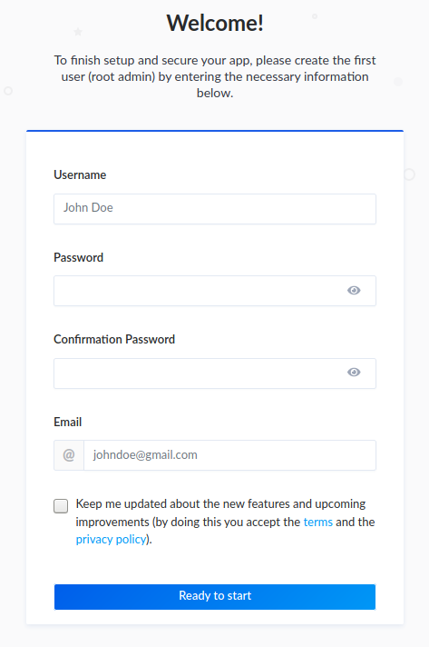
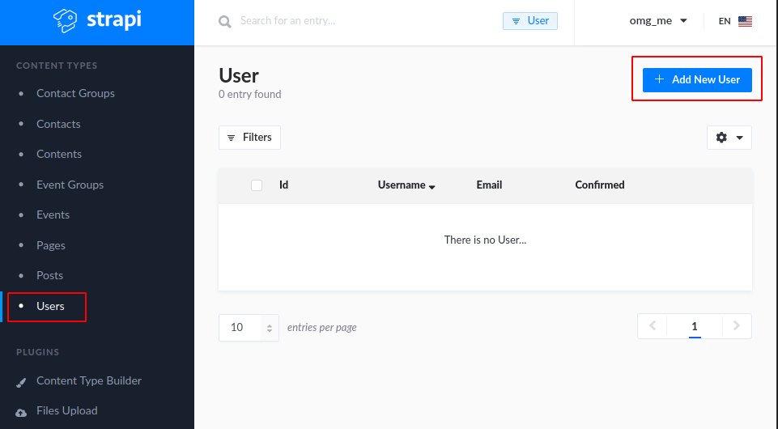
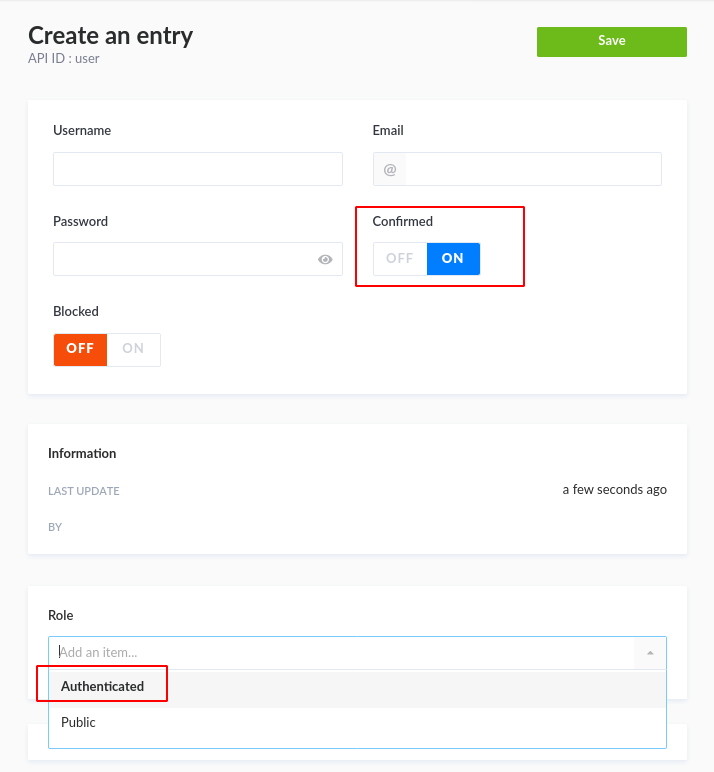
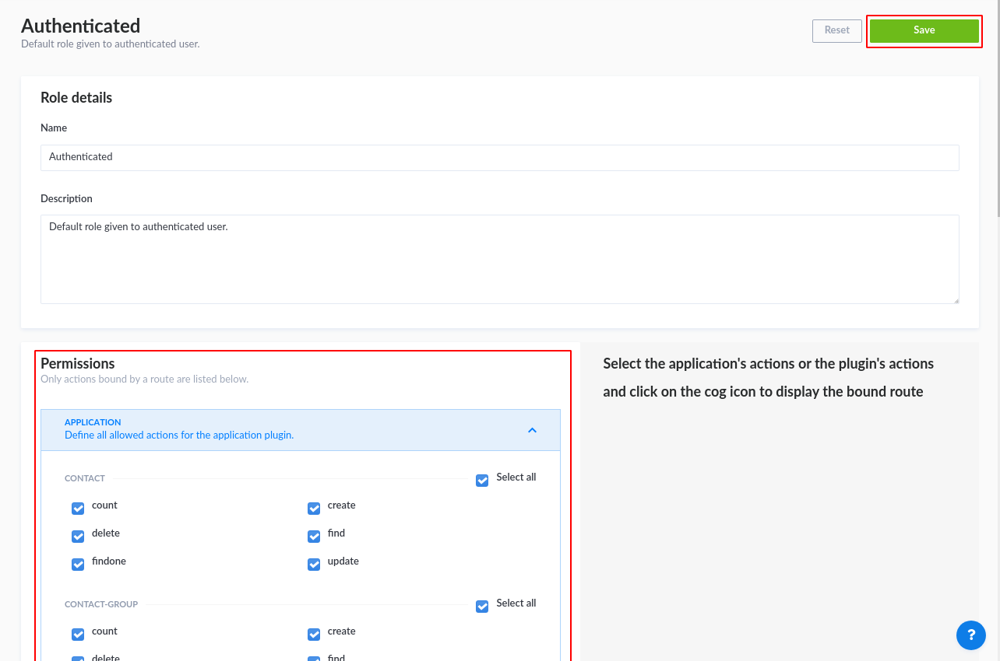
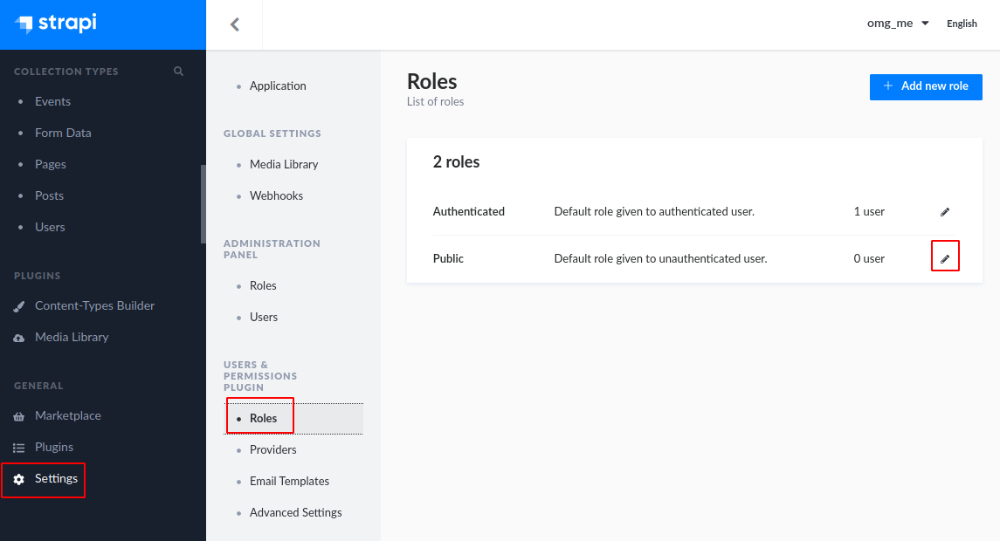
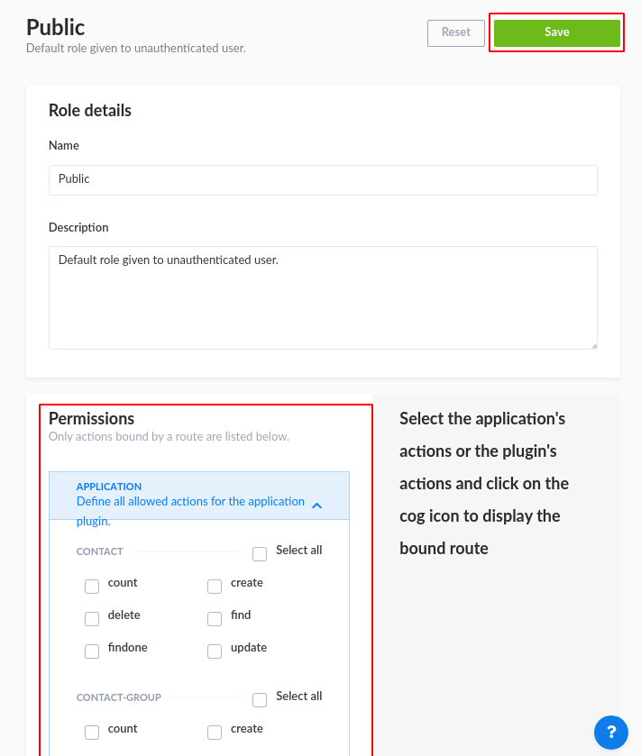

# Climatestrike backend

This repository contains the backend code for the climatestrike-website [repository](https://gitlab.com/cs-ch/website/climatestrike-backend). The backend is based on [strapi](https://strapi.io) (thanks!).

## Getting stared
```
git clone https://gitlab.com/cs-ch/website/climatestrike-backend
```

### Development
It makes sense to put all relevant environment variables into a `.env` file, which strapi automatically includes. For local development to work, you must put at least a value for the JWT_SECRET. After that configure your stuff, install the dependencies and build strapi!

```
echo JWT_SECRET=$(openssl rand 64 | base64 | sed ':a;N;$!ba;s/\n//g')>>.env

pushd plugins/wysiwyg
npm i
popd
```
Then adjust the database, server configurations as well as the `config.json` to your needs and run 
```
npm run build
npm run develop
```
to start the development environment. Please refer to the [strapi documentation](https://strapi.io/documentation/3.0.0-beta.x/getting-started/quick-start.html#_4-create-a-new-content-type) for further information.

### Development with local database
For local development, it can be useful to develop against a SQLite database. For this, adjust your `./config/database.js` as follows:
```JavaScript
module.exports = ({ env }) => ({
    defaultConnection: "default",
    connections: {
      default: {
        connector: "bookshelf",
        settings: {
          client: "sqlite",
          path: "./.tmp/data.db",
          schema: "public"
        },
        options: {},
      },
    },
  });
```
Then restart your strapi instance. When you navigate to `http://localhost:1337`, you will have the ability to create a new super admin:



### User setup
#### Technical API user
In our use case, we want a technical user with read (and probably also write) permissions. For this, go to  Collection Types -> Users, to create a new technical user:



* Auto-confirm the user and use the authenticated:



* Next, go to Settings -> Roles and modify your "Authenticated" role to your likings. For local development you could e.g. allow all permissions like so. However, this is not reccomended for production environments.




Make sure to save your changes.

#### Restrict public user access
In our case, the CMS data should only be read by the technical user, but not public users. Therefore we have to restrict the premissions of the public users like so:

* Go to Settings -> Roles



* Modify your "Public" role, so that all permissions are revoked.




## Helpful functions
- Use `openssl rand 64 | base64` to generate a new JWT token

## Troubleshooting
If you have troubles installing sqlite locally, you might need to set your python:
```
npm config set python /usr/local/bin/python3
```
